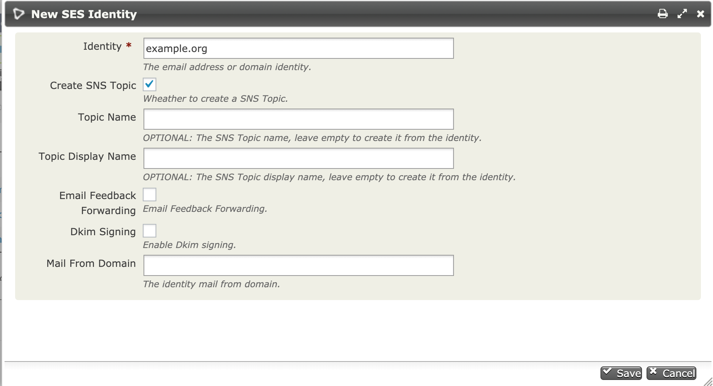
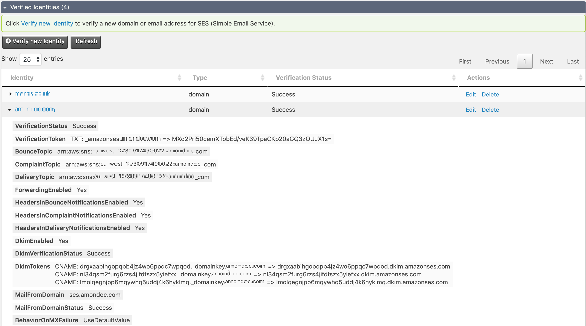
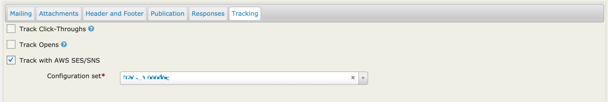

# CiviCRM AWS

Extension that aims to integrate Amazon Web Services (AWS) with CiviCRM, currently it integrates with Simple Email Service (SES) and Simple Notification Service (SNS) to handle CiviMail bounces and open and click tracking.

The extension is licensed under [AGPL-3.0](LICENSE.txt).

## Requirements

* PHP v7.1+
* CiviCRM 5.8+

## Installation (Web UI)

This extension has not yet been published for installation via the web UI.

## Installation (CLI, Zip)

Sysadmins and developers may download the `.zip` file for this extension and
install it with the command-line tool [cv](https://github.com/civicrm/cv).

```bash
cd <extension-dir>
cv dl aws@https://github.com/mecachisenros/aws/archive/master.zip
```

## Installation (CLI, Git)

Sysadmins and developers may clone the [Git](https://en.wikipedia.org/wiki/Git) repo for this extension and
install it with the command-line tool [cv](https://github.com/civicrm/cv).

```bash
git clone https://github.com/mecachisenros/aws.git
cv en aws
```

## Usage

### Create IAM User
First you'll need to create an IAM user to get the access you need to use this extension.
1. Login to the [AWS console](https://console.aws.amazon.com/iam/home)
2. Click the **Add user** button
3. Enter a name for the user i.e. CiviUser
4. Under **Access type** check the checkbox for **Programmatic access**
5. Click the **Next: Permissions** button
6. Click the **Attach exisiting policies directly** in the **Set permissions** section
7. Type **AmazonSESFullAccess** in the search bar and check the checkbox to add the permission
8. Type **AmazonSNSFullAccess** in the search bar and check the checkbox to add the permission
9. Click the **Next: Review** button
10. Click the **Create user** button

You will see the user security credentials (**Access Key ID** and **Secret Access Key**), copy and store them in a safe place or download the `.csv` as Amazon will not show them again. If you lose them you can always create a new user.

### User credentials
It's recommended to set your user credentials in the `civicrm.settings.php` file, like below:
``` php
/**
 * CiviCRM AWS Access Key.
 */
if (!defined('CIVICRM_AWS_ACCESS_KEY')) {
  define('CIVICRM_AWS_ACCESS_KEY', 'your_access_key');
}

/**
 * CiviCRM AWS Secret Key.
 */
if (!defined('CIVICRM_AWS_SECRET_KEY')) {
  define('CIVICRM_AWS_SECRET_KEY', 'your_secret_key');
}

/**
 * CiviCRM AWS Region.
 * Avalable regions for SES/SNS are:
 * us-east-1|us-west-2|eu-west-1
 */
if (!defined('CIVICRM_AWS_REGION')) {
  define('CIVICRM_AWS_REGION', 'eu-west-1');
}
```

Alternatively, you can navigate to **Administer/AWS/User Credentials** and set your user credentials and region.

### Verify SES Identity



1. Navigate to **Administer/AWS/SES Identities and Configuration sets**
2. Click on **Verify new identity**
3. Add your Identity, domain or email address
4. Check the **Create SNS Topic** box
5. Click save

The rest of fields are optional, an Identity will be created with it's SNS topic and Subscription for Bounce and Complaints notifications. The Topic name if left empty, it will be automatically created in the form of:
* `example.org` => `example_org`
* `me@example.org` => `me_at_example_org`

Once saved you can view the verfication token and dkim tokens that you must add to your domain's DNS records by clicking on the identity name.



### SMTP User
1. Sign in to the [SES console](https://console.aws.amazon.com/ses/home)
2. Click on **SMTP Settings** in the navigation menu
3. Click on **Create My SMTP Credentials**
4. Type a name for the SMTP user
5. Click the **Create user** button
5. Click on **Show User credentials** and **Download credentials**

In CiviCRM set your [Outbound Mail](https://docs.civicrm.org/sysadmin/en/latest/setup/civimail/outbound/#smtp) settings to use SMTP.

**SMTP Server**:
* email-smtp.us-east-1.amazonaws.com
* email-smtp.us-west-2.amazonaws.com
* email-smtp.eu-west-1.amazonaws.com

**SMTP Port**: 587
**Authentication**: Yes
**SMTP Username**: you smtp username
**SMTP ServerPassword**: your smtp password


### CiviCRM settings

Ensure your default [Mail Account](https://docs.civicrm.org/sysadmin/en/latest/setup/civimail/#adding-an-incoming-email-account-for-processing-bounces-andor-email-to-activities) for bounce processing is set to use a domain that you verified in SES.

Ensure that your **From Emails Address Options** are verified in the SES.

### Open/Click tracking

1. Sign in to the [SES console](https://console.aws.amazon.com/ses/home)
2. Click on **Configuration Sets** in the navigation menu
3. Click on **Create Configuration Set**
4. Type a name
5. Click the **Create Configuration Set** button
5. Click on the Configuration set you just created
6. In the **Add destination** dropdown select **SNS**
7. Type a name
8. Check the boxes **Open** and **Click**
9. Select the **Topic** created for your verfied domain i.e `example_org`
10. Click save

When cretting a Mailing, the tracking tab has a new option **Track with AWS SES/SNS**, check the option and select the Configuration set you just created.



All URLs will be tracked using SES tracking, including CiviCRM Contribution, Profiles, and Events URLs.

You can set a default Configuration set to be used for every mailing navigation to **Administer/AWS/SES Settings**.

## Todo

* One click option to generate/set the SMTP password
* API for SES configuration sets
* Forms to create/edit configuration sets
* List Configuration sets in the Identities page

## Wishes
* Send using SES API
* Integrate S3 for file storage
